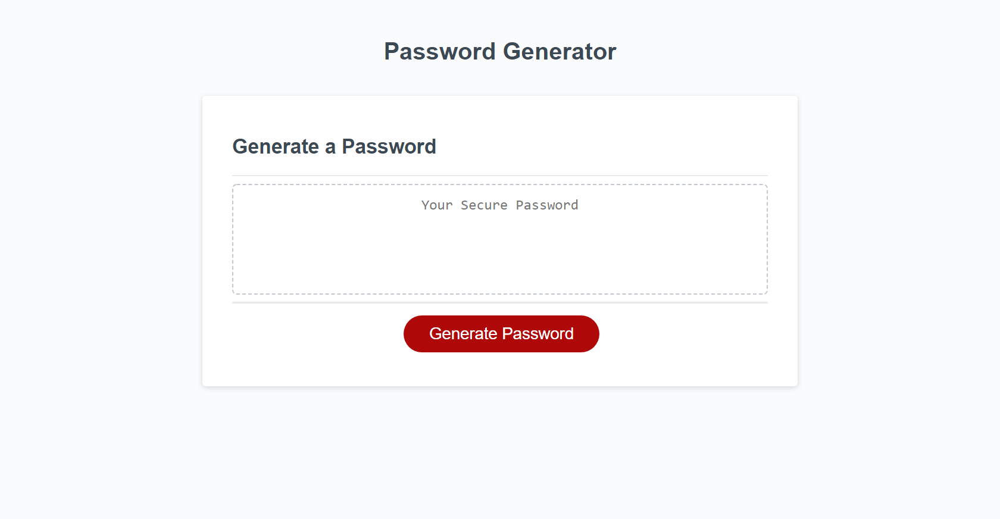

# Password Generator <!-- omit in toc -->
- [Description](#description)
- [Technologies Used](#technologies-used)
- [Gotha Moments](#gotha-moments)
- [Demo](#demo)
- [Test Conditions and Grading Criteria](#test-conditions-and-grading-criteria)
  - [User Story](#user-story)
  - [Acceptance Criteria](#acceptance-criteria)
  - [Grading Requirements](#grading-requirements)
## Description
In this challenge I was tasked with creating a JavaScript program that uses window object methods to communicate with the user. From the user, the program will get criteria from which the program will then generate a randomized password. 
## Technologies Used
At the outset, the HTML and CSS was already provided, so the only edits made to those files was changing the relative paths in the HTML to match how I organized the filesystem. The only technology I used was JavaScript in order to create the alerts and logic for the password generator.
## Gotha Moments
- Randomization always trips me up because usually my first instinct in programming a randomizer is not truly random. For instance, in this exercise, my original code used four arrays of characters (one for each character type), picks an array at random, and then picks a character at random from that chosen array. This is not truly random because this means that characters in arrays with less elements are weighted more highly than characters in arrays with more elements. To rectify this issue, I simply combined the chosen character types arrays into a new array and then picked a random character from that combination array.
- Being limited by the window methods made me think about UX (user experience) a lot because with such few options each one should be meaningful and intuitive. For example, the first prompt asks for the user to enter a number to reflect the length of password they would like, but the prompt method also has a cancel button associated with it. At first, I had the cancel button act similarly to if they entered a incorrect value, but later changed it to leave the password generator prompt sequence entirely. Although I think both are viable options, I believe that changing the code to allow the player to exit the password generation is helpful because the person may not want to be stuck making a new password every time, they click the button (like if it happened on accident).
- An early version of my program generated the charBools array manually for each element. This created a problem of scalability: the program was relying on the order of keys in characters object to match the order in which the user was prompted. If another programmer (or my future self) wanted to change the code to include an option for another set of characters, they would have had to manually program in a new prompt for that set of characters in addition to adding the property to the object in the correct order. I decided to change my approach and loop through the keys of the characters object to create my window prompts which makes it so future changes to properties will result in the program scaling to those changes.
## Demo
A link to the most up-to-date version of the project can be found here: [Password Generator](https://glendonintendo.github.io/challenge3-password-generator/).  

I have also provided a screenshot of the launched webpage below:  


## Test Conditions and Grading Criteria
### User Story
```
AS AN employee with access to sensitive data
I WANT to randomly generate a password that meets certain criteria
SO THAT I can create a strong password that provides greater security
```
### Acceptance Criteria
```
GIVEN I need a new, secure password
WHEN I click the button to generate a password
THEN I am presented with a series of prompts for password criteria
WHEN prompted for password criteria
THEN I select which criteria to include in the password
WHEN prompted for the length of the password
THEN I choose a length of at least 8 characters and no more than 128 characters
WHEN prompted for character types to include in the password
THEN I choose lowercase, uppercase, numeric, and/or special characters
WHEN I answer each prompt
THEN my input should be validated and at least one character type should be selected
WHEN all prompts are answered
THEN a password is generated that matches the selected criteria
WHEN the password is generated
THEN the password is either displayed in an alert or written to the page
```
### Grading Requirements
#### Technical Acceptance Criteria <!-- omit in toc -->
- [x] User is presented with prompts for:
  - [x] password length (between 8-128 characters)
  - [x] types of characters to include (lowercase, uppercase, numeric, special characters)
- [x] User prompts validate choice and at least one character type is selected
- [x] Password matches the selected criteria
- [x] Password is written in an alert or to the page
#### Deployment <!-- omit in toc -->
- [x] Application deployed at live URL
- [x] Application loads with no errors
- [x] Application GitHub URL submitted
- [x] GitHub repository contains application code
#### Application Quality <!-- omit in toc -->
- [x] Application user experience is intuitive and easy to navigate
- [x] Application user interface style is clean and polished
- [x] Application resembles the mock-up functionality
#### Repository Quality <!-- omit in toc -->
- [x] Repository has a unique name
- [x] Repository follows best practices for file structure and naming conventions
- [x] Repository follows best practices for class/id naming conventions, indentation, quality comments, etc.
- [x] Repository contains multiple descriptive commit messages
- [x] Repository contains quality README file with description screenshot and link to deployed application